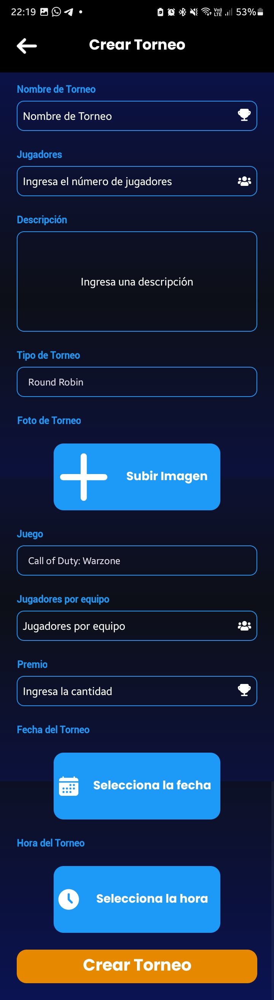
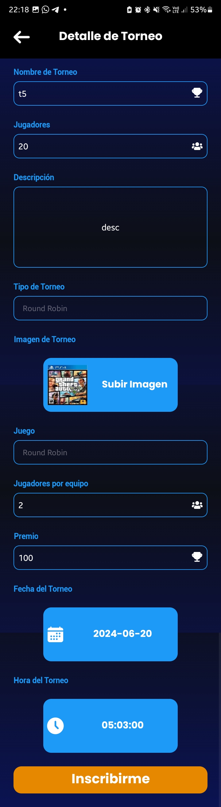

# [Model-View-ViewModel (MVVM)](https://github.com/ahmedeltaher/Android-MVVM-architecture)

    
        

### Model-View-ViewModel (MVVM)

MVVM is a client application architecture template introduced by John Gossman. It serves as an alternative to the MVC and MVP patterns, especially when utilizing Data Binding technology. The key idea behind MVVM is to separate data presentation logic from business logic by delegating the former to a specific class, ensuring a clear separation of concerns.

For more details on MVP, you can check out [**MVP**](https://github.com/ahmedeltaher/Android-MVP-Architecture).

### Why Promote MVVM Over MVP?

1. **Lifecycle Awareness**: 
   - ViewModel: Has built-in lifecycle awareness, reducing the need for manual lifecycle management.
   - Presenter: Lacks lifecycle awareness, requiring developers to manage this aspect.

2. **View References**:
   - ViewModel: Does not hold references to the View, minimizing the risk of memory leaks.
   - Presenter: Holds a reference to the View, even if it is a weak reference, which can lead to potential memory leaks.

3. **Configuration Changes**:
   - ViewModel: Automatically survives configuration changes, preserving the UI state.
   - Presenter: Requires manual handling to survive configuration changes and manage UI state restoration.

### MVVM Best Practices

1. **Avoid View References in ViewModels**: 
   - Ensures that ViewModels remain decoupled from the UI layer, promoting testability and maintainability.

2. **Use Observables for Data Changes**: 
   - Instead of pushing data to the UI, allow the UI to observe changes, leading to a more reactive and flexible architecture.

3. **Distribute Responsibilities**:
   - Add a domain layer if necessary to handle business logic, ensuring a clear separation of concerns.

4. **Data Repository**:
   - Implement a data repository as a single-point entry to your data, centralizing data access and management.

5. **Expose Data State**:
   - Use a wrapper or another LiveData to expose information about the state of your data, enhancing transparency and control over data flow.

6. **Consider Edge Cases and Long-Running Operations**:
   - Account for potential edge cases and how long-running operations can impact your architecture, ensuring robust and resilient design.

7. **Keep Critical Logic Out of ViewModels**:
   - Avoid placing critical logic related to saving clean state or data in the ViewModel, as any call made from a ViewModel can be its last due to lifecycle constraints.

By following these best practices, you can leverage the full potential of the MVVM architecture, leading to a more organized, maintainable, and scalable application.

**What are Coroutines?**
------------------------

**Coroutines:**
Coroutines are lightweight threads used for asynchronous programming. They not only facilitate asynchronous operations but also offer various capabilities such as concurrency and actor-based programming.

----------

**How Do Coroutines Work?**
------------
Kotlin coroutines allow you to perform asynchronous tasks in a sequential manner. Creating a coroutine is significantly more resource-efficient than creating a traditional thread.

**Benefits of Coroutines**
-----------------------------

- **Sequential Asynchronous Code**: Write asynchronous code that reads like sequential code, making it easier to understand and maintain.
- **Cost Efficiency**: Coroutines are much cheaper to create and manage compared to threads.
- **Simplicity**: Avoid unnecessary complexity by using coroutines instead of patterns like observables when they are not needed.
- **Lifecycle Management**: Parent coroutines can automatically manage the lifecycle of their child coroutines, simplifying resource management.

**Keep your code clean according to MVVM**
-----------------------------
 

  

**Tournament App Screenshots**
-----------------------------

